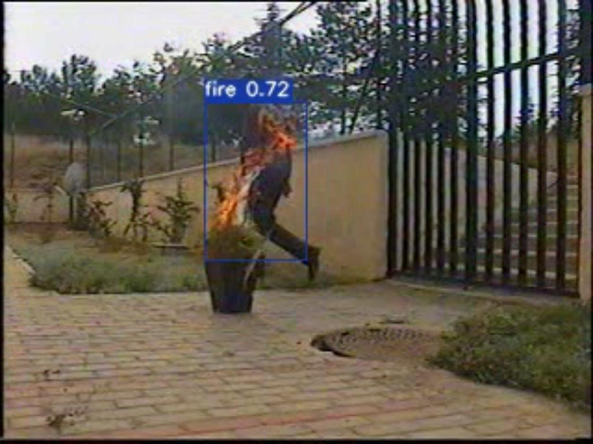

## fire-smoke-detect-yolov4-v5 and fire-smoke-detect-dataset

* author is leilei
* fire-smoke-detection qq群: 980489677, qq2群: 710514100
* [**README_ZN 中文版说明**](./readmes/README_ZN.md)
* [**README_EN English Description**](./readmes/README_EN.md)
* [**yolov4 tensorrt python inference**](https://github.com/gengyanlei/onnx2tensorRt)
* [**Note: 百度Paddle智慧城市生态使用本人烟火检测数据集**](https://github.com/PaddlePaddle/awesome-DeepLearning/tree/master/Paddle_Enterprise_CaseBook/Fire_and_Smoke_Detection#3-%E6%95%B0%E6%8D%AE%E5%87%86%E5%A4%87)

<!--
### Note
```
  本人在inspur-浪潮云从事AI，校聘生，6.23日前谈完绩效B(S,A,B,C,D)，本来绩效是按照3月底前计算发放，
  结果6月24日离职，然后就不给绩效奖金了，领导承认我的工作贡献，但是就不给我奖金money，说我离职了，公司规定不发，
  社会的残酷，请问@浪潮集团董事长-邹庆忠董事长，你们就是这么对待校聘生和人才的，虽然我不是什么大人才，
  但是这样的不公平，
  奉劝学弟学妹们不要选择浪潮，除了浪潮信息部分部门，其他的都是。。。
```
-->

### fire-smoke-detect-demo
||
|----|

### Data Label Tool
+ [CVAT](https://github.com/openvinotoolkit/cvat)
+ [CVAT-Tutorial](https://blog.csdn.net/LEILEI18A/article/details/113385510)

### Other
* [leilei's blog](https://blog.csdn.net/LEILEI18A/article/details/107334474)
* [VSCode Remote SSH 安装教程](https://blog.csdn.net/LEILEI18A/article/details/102524181)
* [segmentation_pytorch 语义分割](https://github.com/gengyanlei/segmentation_pytorch)
* [building-segmentation-dataset 遥感影像建筑语义分割](https://github.com/gengyanlei/build_segmentation_dataset)
* [reflective-clothes-detect-dataset 安全帽反光衣检测](https://github.com/gengyanlei/reflective-clothes-detect)
