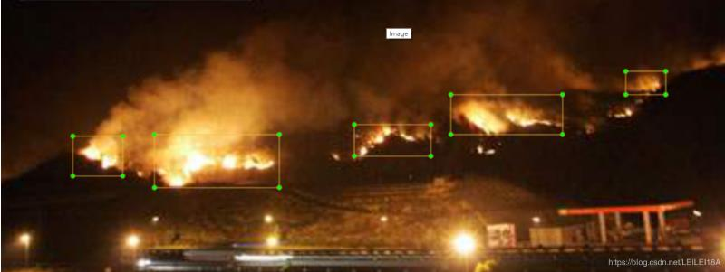

#  烟火检测-中文说明
## 烟火检测-烟火检测数据集

* 作者： leilei
* 烟-火检测 qq群(已满): 980489677, qq2群: 710514100
* 如果此项目对您有所帮助，请给个star，您的star是对我的鼓励！
* 注意：yolov4仅支持火灾检测，yolov5s支持烟雾-火灾2类检测！

### 安装环境
```
    python: 3.6+
    ubuntu16.04 or 18.04
    darknet (cuda10.0 docker) ***
    pytorch 1.6+ (cuda10.2 docker)
```

### 新开源的数据集项目
* 工作服反光衣-安全帽数据集: [reflective-clothes-detect-dataset](https://github.com/gengyanlei/reflective-clothes-detect)

### 改进优化
* eg：烟雾进一步细分成白烟、黑烟、灰烟，火灾也可进一步细化

### 数据集下载细节
* [烟火(10827张图像,无标签)-百度云盘下载链接](https://pan.baidu.com/s/1GhFKbp6hN26hxJWXIg_W2A) 提取码->(hhwq)
* [烟火(2059张图像,含标签)-百度云盘下载链接](https://pan.baidu.com/s/1AvCMcmZ7SaAZznmyTO65cg) 提取码->(3q4r)
* [烟火(2059张图像,含标签)-GoogleDrive下载链接](https://drive.google.com/file/d/1ydVpGphAJzVPCkUTcJxJhsnp_baGrZa7/view?usp=sharing)
---
* [yolov4火灾检测模型-百度云盘下载链接](https://pan.baidu.com/s/14g0SkV5vR8OhnDOCTW6r9A) 提取码->(w3ip)
* yolov5烟雾火灾检测模型 直接在yolov5文件夹中！
* [darknet-yolov4官方github安装教程](https://github.com/AlexeyAB/darknet#how-to-compile-on-linux-using-make)
* [yolov4.conv.137](https://drive.google.com/open?id=1cewMfusmPjYWbrnuJRuKhPMwRe_b9PaT)
* 如果想使用最新版本darknet预测函数，请参考[latest_darknet_API.py](https://github.com/gengyanlei/fire-detect-yolov4/blob/master/latest_darknet_API.py)代码。
    ```
    由于官方darknet预测图像，返回的画框图像是608*608，而非原始图像，坐标框也是如此，
    因此，本人参考官方代码，修改成图像-视频预测在一起的代码，并且是原始图像！
    ```

### 数据集详细情况说明
* 烟火检测数据集(按照Pascal VOC格式排列):
    ```
    --VOC2020
        --Annotations (xml_num: 2059)
        --ImageSets(Main)
        --JPEGImages (image_num: 2059)
        
        --label_name: fire
    ```
* 解压压缩文件命令
    ```
    tar -xzvf ***.tar  (win or linux: Git Bash)
    or 
    7zip (win: 7zip; 360zip 需要解压2次)
    ```
* 将VOC格式转成yolo格式:
    ```
    调用yolov4 -> scripts -> voc_label.py
    ```
* 烟火检测数据集包含的场景类型:
    ```
    大火-小火，建筑起火、草原起火、森林起火、车辆(汽车、卡车、摩托车、电动车)起火、白天-黑夜起火、室内-室外起火；
    烟雾同火场景一致！
    ```
* 百度-Bing图片爬虫代码
    ```
    请使用 crawl_baidu.py 或 crawl_baidu_bing.py
    ```
* **数据预标注** ###############关键###################
    ```
    (1)下载10827烟雾-火灾检测数据集
    (2)利用本人开源的yolov5火灾-烟雾检测模型，为未标注的图像预标注
    (3)人工修正火灾-烟雾检测预标注，重新训练yolov4、yolov5
    (4)加油！！！
    ```

### yolov4 测试-训练代码使用说明
* yolov4测试：

    1. 首先按照yolov4，本人已经将自己编译好的darknet上传，因此你不需要二次编译；将yolov4中的libdarknet.zip解压出来libdarknet.so！
    2. 下载百度云盘中的yolov4火灾检测模型，将其放到backup_fire文件夹；
    3. 调用darknet_API.py函数:
        ```
        from darknet_API import Detect
        detect = Detect(metaPath=r'./cfg/fire.data', configPath=r'./cfg/yolov4-fire.cfg',\
                        weightPath=r'./backup_fire/yolov4-fire_best.weights',\
                        namesPath=r'./cfg/fire.names')
        image = cv2.imread(r'/home/Datasets/20200714085948.jpg', -1)
        draw_img = detect.predict_image(image, save_path='./pred.jpg')
        ```
* yolov4转onnx：
    
    1. yolov4转onnx 参考 ./yolov4/yolov4_to_onnx/yolov4_to_onnx.py
    2. onnx转trt engine 参数 ./yolov4/yolov4_to_onnx/onnx_to_trt7.py
* yolov4 训练：

    1. 将VOC格式转成yolo格式
    2. 修改cfg等文件的配置参数
    3. 执行如下命令:
        ```
        ./darknet detector train cfg/fire.data cfg/yolov4-fire.cfg yolov4.conv.137 -gpus 0 -map -dont_show
        若出现显存不足，可修改batch的大小和取消random多尺度，默认情况下random=1，取消将random=0
        ```
### yolov5 测试代码使用说明
* yolov5测试：

    1. 切换到yolov5，终端执行如下命令:
    ```
    python detect.py --source ***/aaa.jpg --weights ./best.pt
    ```

### 可视化
* ./result: 火灾预测

||
|----|

* ./xml_lab: 火灾标注

||
|----|

### 参考博客-github项目
* train_data contain 1-2-3-4:
* train_data1: https://blog.csdn.net/LEILEI18A/article/details/107334474
* train_data2: https://bitbucket.org/gbdi/bowfire-dataset/downloads/
* train_data3: https://github.com/OlafenwaMoses/FireNET/releases/download/v1.0/fire-dataset.zip
* train_data4: https://github.com/cair/Fire-Detection-Image-Dataset/blob/master/Fire%20images.rar
* fire-demo-dataset: http://signal.ee.bilkent.edu.tr/VisiFire/Demo/SampleClips.html
* google云盘下载链接由qq群中小伙伴提供

### 郑重声明:
* **本数据仅学术探索！！！**

### 本人构建的其它数据集
* [building-segmentation-dataset](https://github.com/gengyanlei/build_segmentation_dataset)
* [reflective-clothes-detect-dataset](https://github.com/gengyanlei/reflective-clothes-detect)
